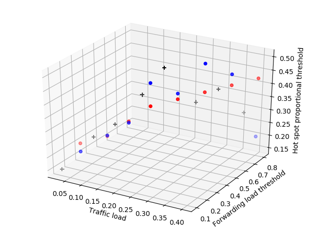
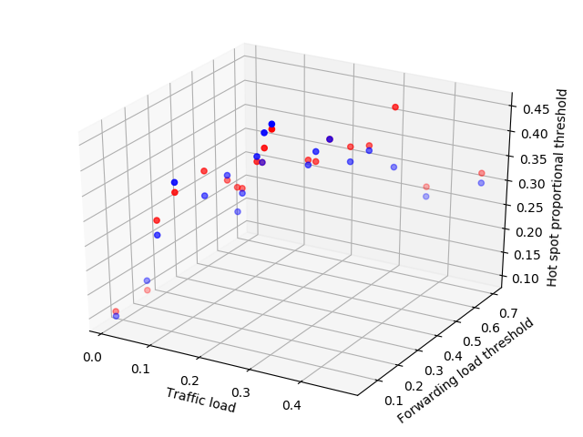

## 多元线性回归模型

data.csv 为训练集，data_test.csv为测试集

使用sk-learn的linear_model实现了二元的预测模型，并进行三维空间内的可视化处理

训练效果示例：

> "+" 为训练集，蓝点为测试集真实值，红点为测试集预测值

## 决策树回归模型

使用sk-learn的DecisionTreeRegression

> 图中只显示测试集，蓝色为真实值，红色为预测值

